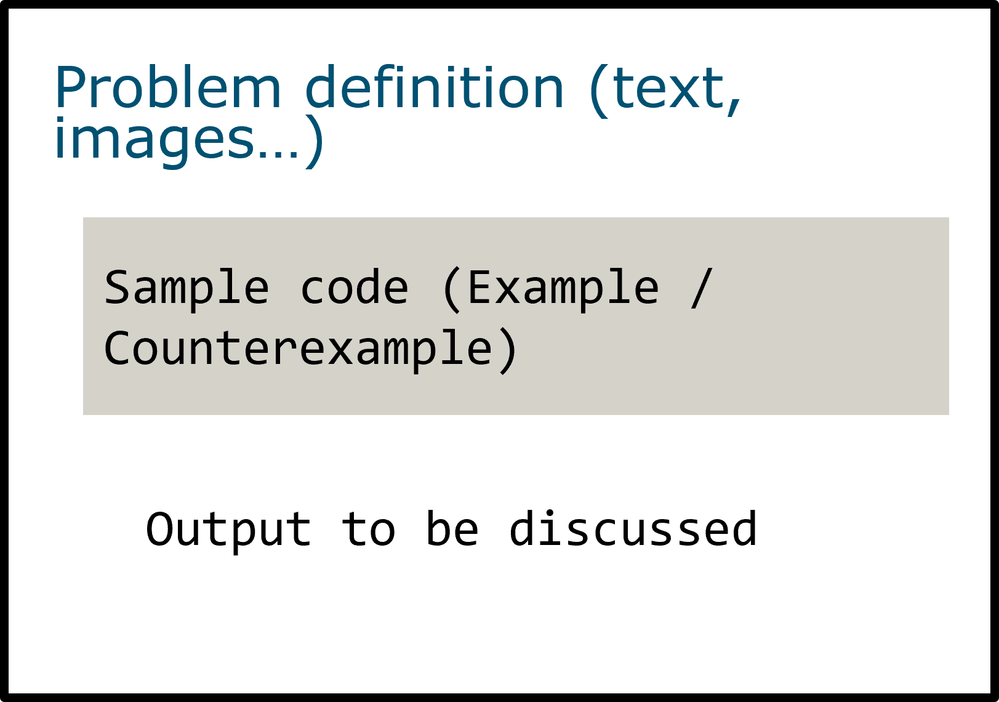
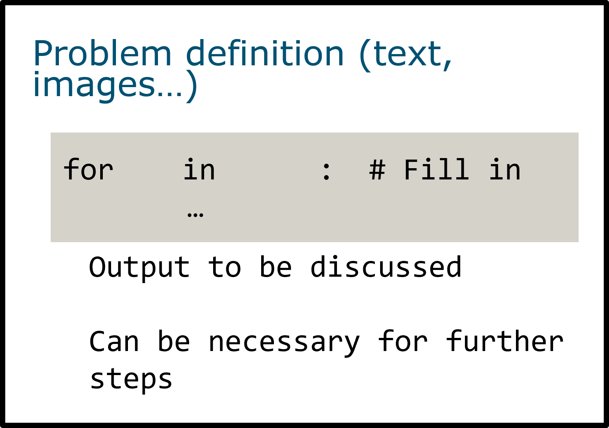
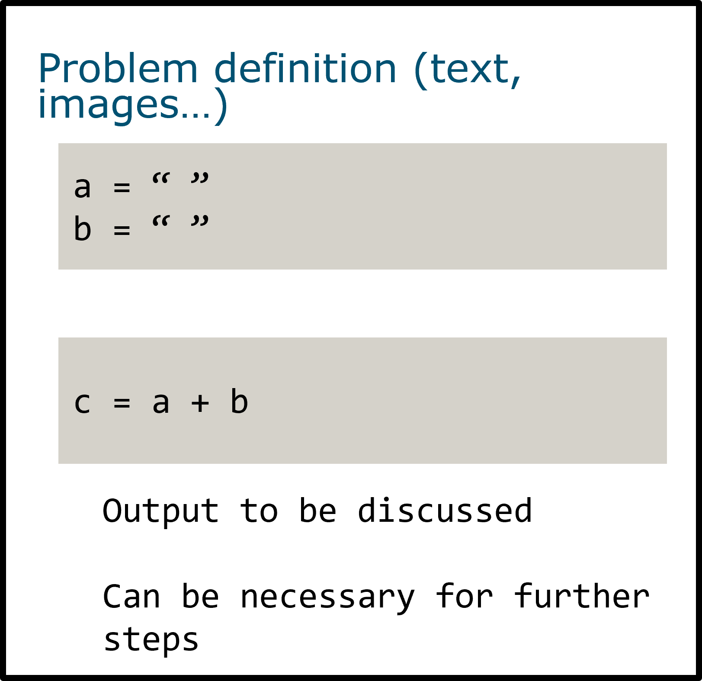
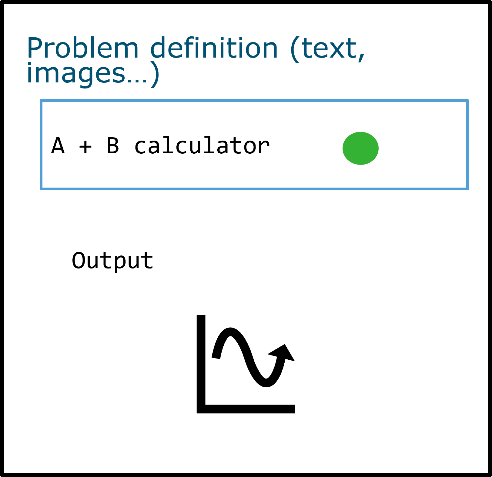
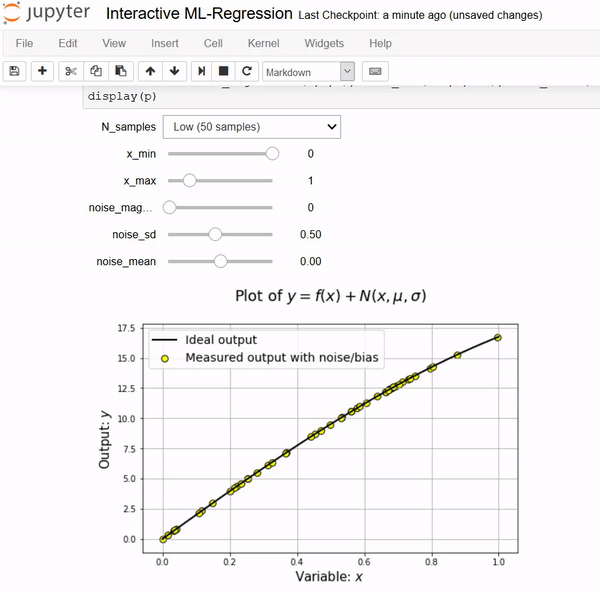

# E-learning module development
## Goals of a module
- Guide the students through an assignment preparation/course content.
- Deconstruct a problem into its core elements. 
- Engage students with the material and with their partner(s)
- Be useful as reference materials when studying (standalone demonstrations) or guide a student through content (worksheets)

Mainly: use of Jupyter Notebooks (either in JupyterLab or VS)

## Methodology
### Creating a repository of Jupyter Notebook materials
- Challenges
  - Content is adequate to the context(s) in which it will be used
	- Successfully engaging students
	- Fulfilling the learning outcomes
	- Enable constant evaluation
- Approaches
	- Use of notebooks to generate a set of course materials, worksheets and standalone dashboards/apps.
	- Provide students with the strategies they need to master the learning outcomes. Limit the complexity of the examples and focus on maximizing reflection and discussion.
	- Enable students to work together, discuss and provide feedback on each module.

### Types of materials and exercises using Jupyter Notebooks
- Worksheet
	- Read and shift-enter materials/ Examples and counter-examples.
	
	
	- Fill in the blanks, run and reflect
	
	
	- Tweak parameters, run and reflect
	
	
	- Simple widgets that help reduce the complexity of a concept
	-

	
- Notebook as a dashboard/app
	- Standalone dashboards with a focus on tweaking and visualizing some model
	- Interactive modules students can use to test their own scripts Pictured: [Interactive Machine Learning](https://github.com/tirthajyoti/Interactive_Machine_Learning)
	
	
	
### Limitations and setbacks
-	Students should bear in mind the differences between notebooks and scripting.
-	How to make notebooks foolproof?
	-	Introduce the functioning of notebooks and basic troubleshooting skills  (restarting kernel, rerunning previous cells…).
	-	These aspects could be tackled as extra modules in the course materials

### Implementability

#### Integration in BrightSpace?
Provide notebooks as downloadable files.

#### Using GitLab for content delivery, teamwork and discussion
-	Students would copy the repository with the course contents. 
-	Familiarize students with Git from assignment 1. 
-	Content delivery through a course repository, like in many online courses. 
-	Useful for teamwork
-	Students can use issues as a forum or to give feedback on the module.
-	Integration with code grading tools like CodeGrade is possible.

## References

1.	Teaching and Learning with Jupyter. https://jupyter4edu.github.io/jupyter-edu-book/index.html.

